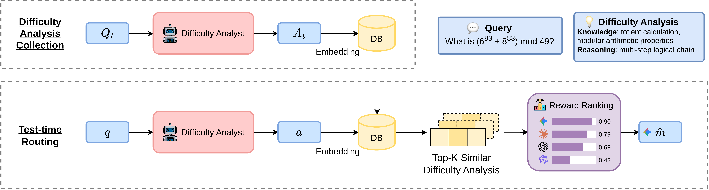

# VDAR-Router: Adaptive LLMs Routing via Verbalized Query Difficulty Analysis Retrieval

Yu-Chien Tang, Jun-Chen Hung, Wen-Chih Peng, An-Zi Yen

Department of Computer Science, National Yang Ming Chiao Tung University, Taiwan



Large language models are increasingly used in practical systems, making efficient model selection important for reducing deployment cost. LLM routing has emerged as a practical solution for allocating each input query to an appropriate model under a desired cost-performance trade-off. Existing routing methods often estimate model suitability from the surface semantics or embedding similarity of the input query. However, such methods may ignore the underlying difficulty of a query, leading to suboptimal routing decisions. To address the challenge, we propose VDAR-Router, a difficulty-aware retrieval-based routing framework. For each input query, VDAR-Router first generates an explicit difficulty analysis. It then retrieves historical examples with similar difficulty profiles. Based on the retrieved records, it estimates candidate model suitability and selects the model using a reward function that considers both performance and cost. Experiments on three datasets show that VDAR-Router consistently achieves better cost-performance trade-offs than existing baselines. These results demonstrate the effectiveness of difficulty-aware retrieval for training-free LLM routing. Case studies further show that explicit query analysis helps retrieve more relevant examples and supports more reliable routing decisions.

## Repository Structure

```
assets/                      PNG figures and tables embedded in this README

expert-5k/                    Python implementation of the VDAR-Router framework and its experiments
|-- cache/                    Caching layer for LLM API calls: OpenAI client wrapper, request processing, storage
|-- config/                   JSON configuration for evaluation runs and LLM settings
|-- difficulty_aware_router/  Core router implementation
|   |-- agents/               Difficulty analysis agent that produces explicit query difficulty analyses
|   |-- training/             Artifact builder and example trainer for the retrieval database
|   `-- difficulty_aware_router.py   Main router: difficulty analysis, retrieval, reward-based model selection
|-- experiment/               Experiment pipelines
|   |-- generate_dataset/     Dataset generation with adapters for Arena Expert 5K and RouterBench
|   |-- evaluation/           Evaluation pipeline, including IRT (Rasch) alignment and k-gamma analysis
|   `-- training/             Training pipeline for router artifacts
|-- pyproject.toml            Project metadata and dependencies
`-- uv.lock                   Lockfile managed by uv

paper-latex/                  LaTeX source, figures, tables, and bibliography for the paper

routerbench/                  RouterBench experiments: reward-based routing baselines and experiment notes
|-- llmrouterbench/
|   `-- reward_router.py      Reward-based routing baseline: selects the model with the highest reward
|-- routerbench/
|   |-- scripts/
|   |   `-- reward_router.py  Script variant of the reward-based routing baseline
|   |-- experiment_progress.md  Experiment progress and results report
|   `-- prompt_version_control.yaml  Prompt version tracking
|-- requirements_conda.txt    Conda dependency manifest
`-- requirements_uv.txt       uv dependency manifest
```
